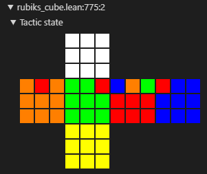

# rubiks-cube-group

This project formalizes the Rubik's cube group as a product of corner orientation, corner permutation, edge orientation, and edge permutation.

The solvable subgroup is defined as the the set of positions where both orientations sum to 0 and the permutations have the same sign.

### Widget

This project includes a widget to visualize elements of the group as physical puzzle states.

For example:

```
#html (R U R' U' R' F R2 U' R' U' R U R' F').to_html
```

produces

